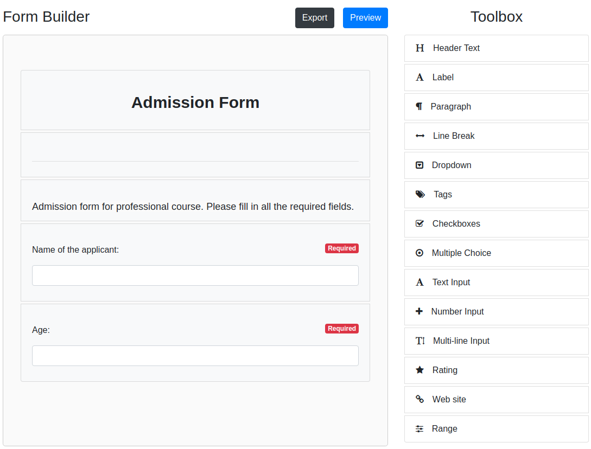
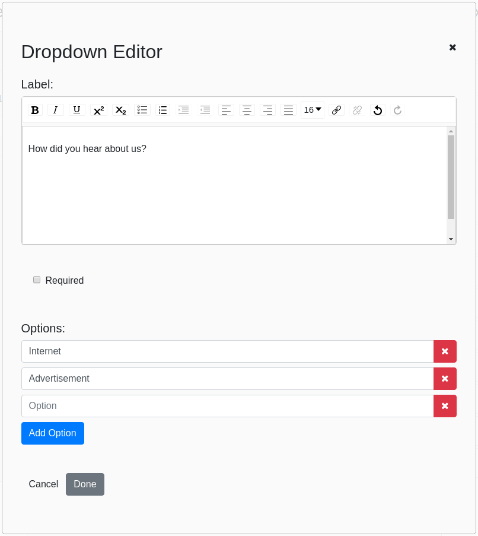
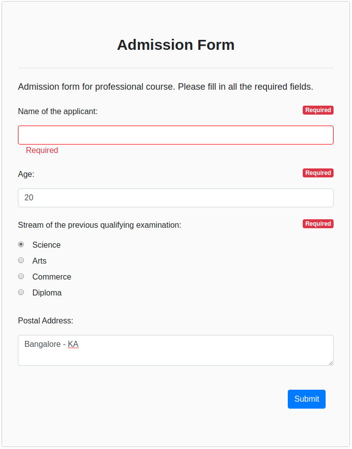
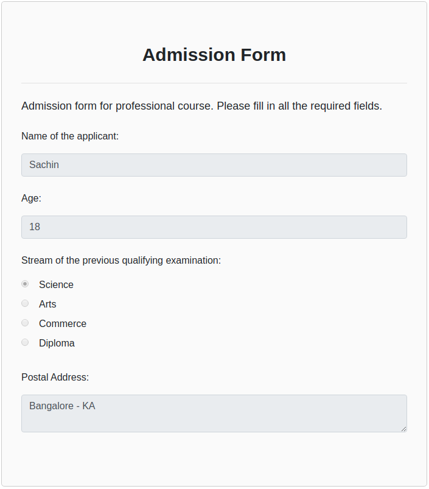

# CB React Forms [](https://badge.fury.io/js/cb-react-forms) [](https://opensource.org/licenses/MIT)

## React Form Builder

### Form Builder [DEMO](https://cb-react-forms.netlify.com/)

A complete react form builder that interfaces with json data to load and save generated forms.



# Basic Usage

```jsx
import React from "react";
import ReactDOM from "react-dom";
import { FormBuilder } from "cb-react-forms";

const Example = props => (
  <FormBuilder 
    onSubmit={}
    items={}
  />;
);

ReactDOM.render(<Example />, document.getElementById("root"));
```

# Props

```jsx
const items = [
  {
    key: "Header",
    name: "Header Text",
    icon: "fa fa-header"
  },
  {
    key: "Paragraph",
    name: "Paragraph",
    icon: "fa fa-paragraph"
  },
  {
    key: "Dropdown",
    name: "Dropdown",
    icon: "fa fa-caret-square-o-down"
  }
];

const onSubmitFunc = () => {
  // Submit Function
};

<FormBuilder 
  items={items} 
  onSubmit={onSubmitFunc} 
/>

```

### Form Builder Params:
Name | Type | Required | Description
--- | --- | --- | --- |
onSubmit | function | Required | Invoked on Export Form, gets formData as the argument.
items | array | Optional | List of toolbar items, list of avaiable items can be found below.
## Editing Items:


# React Form Generator

Now that the form is built and saved, let's generate it from the saved json.

```jsx
import React from "react";
import ReactDOM from "react-dom";
import { FormGenerator } from 'cb-react-forms';

const Example = props => (
  <FormGenerator 
    formData={}
    onSubmit={}
  />
);

ReactDOM.render(<Example />, document.getElementById("root"));
```
### Form Generator Params
Name | Type | Required | Description
--- | --- | --- | --- |
formData | array | Required | List of questions data retrieved from FormBuilder.
onSubmit | function | Required | Invoked on form submit, gets answers data as the argument.
readOnly | boolean | Optional | Show a read only version which has fields disabled and removed "Required" labels.
responseData | object | Optional | Answer data, only loads if loading a pre-existing form with values.

## Demo Form:


### List of Toolbar items:

```javascript
const items = [
  {
    key: "Header",
    name: "Header Text",
    icon: "fa fa-header"
  },
  {
    key: "Label",
    name: "Label",
    icon: "fa fa-font"
  },
  {
    key: "Paragraph",
    name: "Paragraph",
    icon: "fa fa-paragraph"
  },
  {
    key: "LineBreak",
    name: "Line Break",
    icon: "fa fa-arrows-h"
  },
  {
    key: "Dropdown",
    name: "Dropdown",
    icon: "fa fa-caret-square-o-down"
  },
  {
    key: "Tags",
    name: "Tags",
    icon: "fa fa-tags"
  },
  {
    key: "Checkboxes",
    name: "Checkboxes",
    icon: "fa fa-check-square-o"
  },
  {
    key: "RadioButtons",
    name: "Multiple Choice",
    icon: "fa fa-dot-circle-o"
  },
  {
    key: "TextInput",
    name: "Text Input",
    icon: "fa fa-font"
  },
  {
    key: "NumberInput",
    name: "Number Input",
    icon: "fa fa-plus"
  },
  {
    key: "TextArea",
    name: "Multi-line Input",
    icon: "fa fa-text-height"
  },
  {
    key: "Rating",
    name: "Rating",
    icon: "fa fa-star"
  },
  {
    key: "HyperLink",
    name: "Web site",
    icon: "fa fa-link"
  },
  {
    key: "Range",
    name: "Range",
    icon: "fa fa-sliders"
  }
];

// NOTE: You can edit the name and the icon (FontAwesome classes) fields but **do not** change the key.
```

## Read Only Form:


# Dependencies
In order to make the Form Builder secure and pretty, there are a few dependencies other than React.
- redux-form
- draft-js
- react-draft-wysiwyg
- react-dnd
- react-star-ratings
- react-select

# Develop
```bash
$ npm install
$ npm start
```
Navigate to localhost:8080/ in your browser and you should be able to see the Form Builder in action.